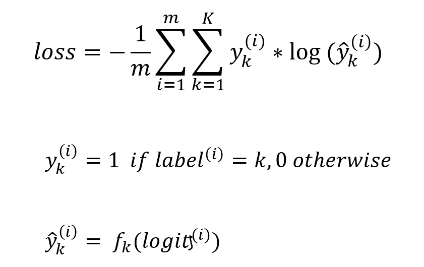

# **Traffic Sign Recognition** 

## Thanh Doan Writeup

**Build a Traffic Sign Recognition Project**

The project code, [Traffic_Sign_Classifier.ipynb](https://github.com/tcdoan/CarND-Traffic-Sign-Classifier-Project/blob/master/Traffic_Sign_Classifier.ipynb),  consists of the following steps:
* Load the [German Traffic Sign Benchmark](http://benchmark.ini.rub.de/?section=gtsrb) data set
* Explore, summarize and visualize the data set
* Design, train and test a model architecture
* Use the model to make predictions on new images
* Analyze the softmax probabilities of the new images
* Summarize the results with this written report


## Writeup / submission

This writeup, README.md, addressed [rubric points](https://review.udacity.com/#!/rubrics/481/view) and serves as the project report for submission. The submission includes [Traffic_Sign_Classifier.ipynb](https://github.com/tcdoan/CarND-Traffic-Sign-Classifier-Project/blob/master/Traffic_Sign_Classifier.ipynb), [Predictions.ipynb](https://github.com/tcdoan/CarND-Traffic-Sign-Classifier-Project/blob/master/Predictions.ipynb), [Predictions2.ipynb](https://github.com/tcdoan/CarND-Traffic-Sign-Classifier-Project/blob/master/Predictions2.ipynb), this README.md file and [new german traffic sign test images](https://github.com/tcdoan/CarND-Traffic-Sign-Classifier-Project/tree/master/newImages) found on the internet.

To replicate the work, just do few simple steps below:
- Clone this repo into your local computer
- Download https://s3-us-west-1.amazonaws.com/udacity-selfdrivingcar/traffic-signs-data.zip
- Unzip *traffic-signs-data.zip* and leave *train.p, valid.p, test.p* files in the same directory that house *Traffic_Sign_Classifier.ipynb* notebook
- Create and activate conda environment [car2](https://github.com/tcdoan/CarND-Traffic-Sign-Classifier-Project/blob/master/car2.yml) - this will install all dependency packages such as tensorflow v1.3.0 and opencv v3.4.2.16
    -  conda env create -f car2.yml
    -  activate source car2
- Launch [Traffic_Sign_Classifier.ipynb](https://github.com/tcdoan/CarND-Traffic-Sign-Classifier-Project/blob/master/Traffic_Sign_Classifier.ipynb)  jupyter notebook
- Run all cells inside the notebook

## Data Set Summary & Exploration

#### **Basic summary of the data set**

I used `pickle.load(f)` function to load `train.p, valid.p, test.p` files into memory and store training data to `X_train, y_train` numpy arrays. Validation data is stored in `X_valid, y_valid` and test data is stored in `X_test, y_test` arrays. I used simple python and numpy functions to compute basic data summary below:

```python
- X_train shape:  (34799, 32, 32, 3)
- X_valid shape:  ( 4410, 32, 32, 3)
- X_test  shape:  (12630, 32, 32, 3)
- Number of training   examples: 34799
- Number of validation examples:  4410
- Number of testing    examples: 12630
- Image data shape:         (32, 32, 3)
- Number of unique classes/labels:   43
```

#### Exploratory visualization of the dataset.

**First exploratory visualization** is implemented in `visualizeImageClasses(images, labels, title, nrows, ncols)` function. The visualization plots number of training labels for each label class using `matplotlib.pyplot`. The plot shows 43 representative traffic signs, one for each unique label, and label them with *image class names, class IDs, and counts of training examples*.


**Second, and third exploratory visualizations** are implemented in `visualizeDataset(images, labels, title='Sample traffic signs', nrows=5, ncols=5)` function. Each visualization randomly selects 25 images and used `matplotlib.pyplot` to plot them. Two dataset visualizations used random traffic signs from training and test sets.

**Third exploratory visualization** is implemented in `visualizeClassCounts(labels, title)` function. The visualization plots the distribution of 43 traffic sign classes from 34,799 training examples. 

**Fourth exploratory visualization** plots the distribution of 43 traffic sign classes using 4,410 data points from validation set. 


**Fifth exploratory visualization** plots the distribution of 43 traffic sign classes using 12,630 data points from test set. 


## Design and Test a Model Architecture

### **Image data preprocessing**

I measured 3 proximate **data normalization** experiments below.

```python
# Experiment 1
# X_train = (X_train - 128.0) / 128.0

# Experiment 2
# X_train = X_train / 255.0 - 0.5

# Experiment 3
X_train = X_train / 255.0
X_valid = X_valid / 255.0
X_test =  X_test / 255.0
```
**Why Data normalization:** Data normalization is performed  here to make sure each input pixel has a similar data distribution (0 to 1.0) so that convergence is more reliable and faster while training the neural network. All 3 experiments yield similar results in terms of convergence rate and reliability when trying with learning rate 0.001.

I experimented with converting input images to grayscale images before using them to train the classifier. My experiments did not show considerable imprevements in terms of training error or validation accuracy rate. As the result I decided to skip  'convert to grayscale' step.

**Data augmentation:** Third exploratory visualization showed that some image classes has more training examples than others. For example `class-0` has 180 training examples while `class-2` has 2010 data points for training. To fix this 10-to-1 skewed class distributions I decided to use data augmentation.

Data augmentation is implemented in `augmentData()` function. The function add more images to any class that have less than a `requiredCount` - a threshold that is roughly set to hight class count. New images are generated for augmentation is below.

```python
# For each category that has less than *requiredCount* training images
    # Repeatedly sample random images from existing ones.
       # Until number of training images = *requiredCount* threshold.
```

As I set `requiredCount = 2000` the difference between the original data set and the augmented data set is the following.

```python
X_train.shape before data augmentation (34799, 32, 32, 3)
augment.shape augmented data           (56847, 32, 32, 3)
X_train.shape after data augmentation  (91646, 32, 32, 3)
```

### **Convolutional neural network model architecture**

My initial model architecture, **model-0**,  is a reimplementation of the original LeNet-5 model, described in the [Gradient-based learning applied to document recognition](https://ieeexplore.ieee.org/document/726791) paper, with modified softmax output layer to emit probabilities for 43 traffic sign classes. With no data augmentation, I trained the model using 34,799 RBG images of size (32, 32, 3). After 30 epochs of training the training accuracy is 100%. The validation accuracy is 91.6% and test accuracy is 90.6%.


The precision, recall and f1-score classification metrics on `never-seen-before test set` for **model-0** are:


Next, I train **model-0** with data augmentation. Using 91,646 augmented images of size (32, 32, 3) I trained the model for 30 epochs and saw the training accuracy is 100%, the validation accuracy is 93.3% and the test accuracy is 92.1%.

Next **model-1** is derived from model-0 by adding **dropout** regularization in-front of rectified linear activation function components for 2 fully connected layers `fc1` and `fc2`. 

```python
# Fully Connected. Input: 5x5xK2. Output: FCK1
fc1 = tf.reshape(pool2, [-1, 5*5*K2])
wd1 = tf.Variable(tf.truncated_normal([5*5*K2, FCK1], mean=mu, stddev=sigma))
bd1 = tf.Variable(tf.zeros([FCK1]))
fc1 = tf.add(tf.matmul(fc1, wd1), bd1)

# adding DROPOUT regularization 
fc1 = tf.nn.dropout(fc1, self.keep_prob)
fc1 = tf.nn.relu(fc1)

# Fully Connected. Input: FCK1. Output: FCK2
wd2 = tf.Variable(tf.truncated_normal([FCK1, FCK2], mean=mu, stddev=sigma))
bd2 = tf.Variable(tf.zeros([FCK2]))
fc2 = tf.add(tf.matmul(fc1, wd2), bd2)

# Adding DROPOUT regularization 
fc2 = tf.nn.dropout(fc2, self.keep_prob)
fc2 = tf.nn.relu(fc2)
```
I trained **model-1** using 91,646 augmented images for 30 epochs. The training accuracy is 99.8%. The validation accuracy is 95.9% and test accuracy is 93.9%. The weighted average precision, recall and f1-score classification metrics on the testset is 0.94, 0.94 and 0.94. However for **class 27** precision is a lowly 0.48, recall is 0.53 and f-measure is only 0.51.

Next **model-2** is derived from model-1 by adding more filters to the 2 convolutional layers. In the first convolutional layer, `conv1`, I increased the number of filters from **6 to 38**.  In the second convolutional layer, `conv2`, I increased the number of filters from **16 to 64**.

**Model-2**, the final model, has the following layers:


I trained **model-2** using 91,646 augmented images for 30 epochs. The training accuracy is 100%. The validation accuracy is 97.9% and test accuracy is 96.6%. The learning curves as the results of training **model-2** using augmented data is below. 


To train the model. I set up the loss function and the training operation as below

```python
loss = tf.reduce_mean(tf.nn.softmax_cross_entropy_with_logits(logits, labels=one_hot_y))
training = tf.train.AdamOptimizer(learning_ratee).minimize(loss)
```

The loss function is computed by averaging cross entropy values for a batch size of `m` training examples. 



- **K=43** is the numer of traffic sign classes.
- **y<sup>(i)</sup>** is the one_hot_coded value of training label of **image<sup>(i)</sup>**
- **f<sub>k</sub>** is the k<sup>th</sup> component of the softmax activation output

The training operation is the process of minimizing the loss function using the LOOP implemented inside `LeNet5.train(self, X_train, y_train, X_valid, y_valid, epochs, batch_size=256)` function.


I used [AdamOptimizer](https://www.tensorflow.org/api_docs/python/tf/compat/v1/train/AdamOptimizer) to train the network and experimented with different paramater values. The default AdamOptimizer values `learning_rate=0.001, beta1=0.9, beta2=0.999, epsilon=1e-08` yield desirable convergence results.

My final model, **model-2** results were:
* training set accuracy of 100%
* validation set accuracy of 97.9%
* test set accuracy of 96.6%


My model architecture is based off the well-known [LeNet-5 model](http://yann.lecun.com/exdb/lenet). The reasons I chose LeNet-5 architecture as a starting point is three fold.

- First, LeNet-5 is a convolutional neural network that works well for *isolated* character recognition and the model for *isolated* traffic sign recognition has similar high-level feature space.
- Second, the given training images inside `train.p` has dimension (32, 32, 3). This dimension is similar to the data used to train the original LeNet-5 model.

- Third, LeNet-5's model architecture is simple to the point that I can train the model  quickly on my desktop.

From LeNet-5 model architecture I iterated a couple of changes. My final model architecture deviates from LeNet-5 architecture in:

1. The number of filters for the first convolutional layer is increased from 6 to 38.
1. The number of filters for the second convolutional layer is increased from 16 to 64.
1. The addition of two **dropout** regularization layers. 

The reason I made changes #1 and #2 is to give the model more 'pattern recognition power' because recognizing traffic signs requires a more powerful neural network than the one designed for recognizing 10 hand-written digits. I made change #3 to reduce model overfitting. **Dropout** regularization helped the final model to generalize better; final validation and test accuracy rates were increased higher.

## Test a Model on New Images

Here are [nine German traffic signs](https://github.com/tcdoan/CarND-Traffic-Sign-Classifier-Project/tree/master/newImages) that I found on the web:


### Here are the results of the prediction:


- The model was able to *correctly predict 9 of the 9 traffic signs*, which gives an accuracy of 100%. This compares favorably to the accuracy 96.6% on the test set of 12,630 traffic sign images inside the downloaded `test.p` file.

- The code for making predictions on my final model is located in the 19th cell of the [Traffic_Sign_Classifier.ipynb notebook](https://github.com/tcdoan/CarND-Traffic-Sign-Classifier-Project/blob/master/Traffic_Sign_Classifier.ipynb).

- The code for visualizing predictions on my final model is located in the 21th cell of the [Traffic_Sign_Classifier.ipynb](https://github.com/tcdoan/CarND-Traffic-Sign-Classifier-Project/blob/master/Traffic_Sign_Classifier.ipynb).

* For the first new image, the model is very sure that this is a `Slippery road` sign (probability of 1.0000). The top five soft max probabilities were 1.00, 0.00, 0.00, 0.00, 0.00.

* For [8 other new images](https://github.com/tcdoan/CarND-Traffic-Sign-Classifier-Project/tree/master/newImages), the model predicts correctly with high confidence from 99.98% to 100.00%. The code to print out 5 softmax probabilities for each new image is located in the 4th cell of the [Predictions.ipynb](https://github.com/tcdoan/CarND-Traffic-Sign-Classifier-Project/blob/master/Predictions.ipynb). 


**To test the model prediction further... I collected [another set of new 9 images](https://github.com/tcdoan/CarND-Traffic-Sign-Classifier-Project/tree/master/new) below**. 
**I then run predictions using the [Predictions2.ipynb](https://github.com/tcdoan/CarND-Traffic-Sign-Classifier-Project/blob/master/Predictions2.ipynb) notebook**


**As [Predictions2.ipynb](https://github.com/tcdoan/CarND-Traffic-Sign-Classifier-Project/blob/master/Predictions2.ipynb) notebook shown, the model still predicts 9 out 9 traffic signs correctly but softmax probabilities confirms confidence for some traffic signs are low.**

---
#### **Performance analysis**

As the below softmax probabilities shown it is quite difficult for the model to classify 
`image #2` and `image #5` with high confidence. 

One characteristic of the new images that cause **difficult for the model to classify is the background objects**. 

Both image #2 and image #5 have more background objects than 7 other new images. The  ratio between background area and trafific sign areas for these 2 images are high.


### (Optional) Visualizing the Neural Network
> I choose to ignore this optional excercise for now.